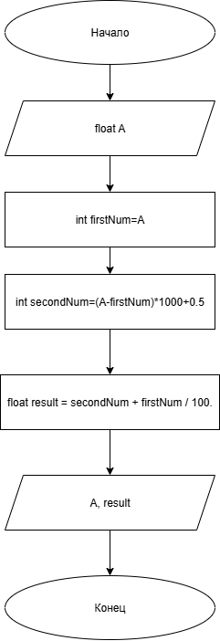

# Домашнее задание к работе 2

## Условие задачи
Дано вещественное число А, содержащее две цифры до запятой и три после. Получить новое число, поменяв в числе А целую и дробную части. (было 21,317 стало 317,21).

## 1. Алгоритм и блок-схема

### Алгоритм
1. **Начало**
2. Инициализировать переменную:
   - `A` (float) = 21.317 — число из задачи.
3. Отделить целое число от остатка и записать в отдельные переменные:
   - `firstNum` (int) = A — убирается дробная часть, а целая присваивается отдельной переменной.
   - `secondNum` (int) = (A - firstNum) * 1000 + 0.5 — убирается целая часть, в дробной сдвигается запятая и число приваивается в новую переменную.
4. Объединть дробную и целую части:
   - `result` (float) = secondNum + firstNum / 100. — объединение измененных частей.
5. Вывести результаты расчетов с подстановкой всех значений в текст.
9. **Конец**

### Блок-схема
 

https://github.com/glebofrl/lab2VSU/blob/master/schemeLab1.png

## 2. Реализация программы

#include <stdio.h>
#include <locAle.h>

void main()
{
	setlocale(LC_CTYPE, "RUS");

	float A = 21.317;
	printf("Вариант 33\n");
	int firstNum = A;
	int secondNum = (A - firstNum) * 1000 + 0.5;
	float result = secondNum + firstNum / 100.;
	printf("Исходное число: %.3f\nИтог: %.2f", A, result);
	getchar();
	
}

## 3. Результаты работы программы

